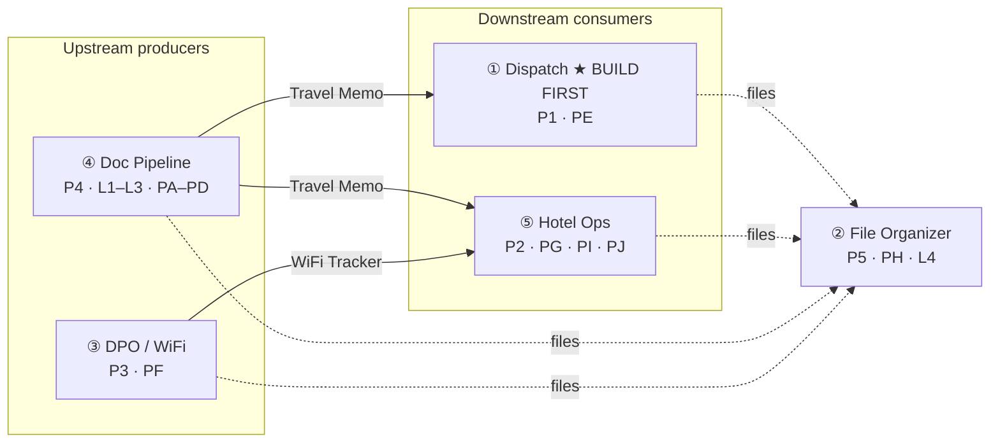

# APPA Agent Automation — Build Flow, Order & Rationale (Recap)

*Recap as of 2026-08-12. Companion to `APPA_Agent_Blueprint.md` (Part 0 portfolio framing). Written as a first-person case-study log — captures not just *what* was built, but the decisions, the reasoning, and the redirections along the way.*

---

## 1. Dependency graph (rewritten)

Runtime data flow between the five agents, annotated with the **build phase** (`P#`) each is constructed in. Solid arrows = live data hand-offs; dotted = "gets filed by ②".

**The one insight this graph encodes:** the build order runs *against* the data flow on purpose. The first two agents built — ① Dispatch (P1) and ⑤ Hotel Ops (P2) — are both **downstream consumers** at runtime (they read the Travel Memo that ④ produces). The upstream producers ③ and ④ are built later. That's only safe because every input already exists as a confirmed historical file, so no agent has to be built before another. **With the data-flow constraint removed, build order is free to optimize for something else entirely.**

---

## 2. Build order & the rationale (the thorough version)

### The three orderings this project went through
1. **Original (7/13):** a calendar plan, ascending complexity.
2. **8/11 directive:** ⑤ Hotel Ops first — my call, justified as "self-contained, reads existing files."
3. **8/12 — final:** **method-first, ① Dispatch first.**

### Why #2 collapsed
I challenged my own 8/11 decision by adding one assumption: *the project is over, so I have every confirmed historical file for every input.* That single assumption dissolves the "self-contained" argument — because if all files exist, then **every** agent is self-contained. "Reads existing files" stops picking Hotel Ops out of the lineup. The justification was gone.

### What should drive order once data-flow no longer constrains it
Only three things legitimately remain:
- **Complexity / learning** — build the smallest reliable unit first to prove the *method*.
- **Value** — hours saved, frequency (the project's headline KPI).
- **Shared foundation** — the data-access reader layer, built once, is Phase 0 regardless.

By complexity, **① Dispatch is genuinely the simplest**: one input (Travel Memo), one branch (pick-up vs send-off), a static output. Hotel Ops is a notch harder (it *writes back* to a living sheet).

### The decision: method-first for agent #1, value-first after
> **Build the smallest end-to-end agent first to de-risk the method; then rank the rest by weighted value.**

For a *first-ever* agentic build, the biggest unknown isn't rooming logic — it's *"can I build a reliable agent pipeline at all?"* The cheapest way to retire that risk is the smallest end-to-end slice. So **"simplest-first" and "riskiest-first" converge on Dispatch.** Once the pattern is proven, the criterion switches to value — which is where Hotel Ops (35+ rooming updates) becomes the clear #2.

### The evidence I demanded before committing
I didn't accept this on assertion — I asked for field-proven backing:
- **Walking Skeleton** (Alistair Cockburn) — build a thin end-to-end implementation first to prove the architecture.
- **Tracer Bullets** (*The Pragmatic Programmer*) — same idea: fire one thin round through the whole system to confirm your aim.
- **Anthropic, *Building Effective Agents*** — start with the simplest solution; add complexity (multi-agent orchestration) only when it demonstrably earns its place.
- **WSJF — Weighted Shortest Job First** (Reinertsen / SAFe) — the economic model for ranking the *remaining* agents by value ÷ size.

### Final order
| Phase | Agent | Why here |
|---|---|---|
| **0** | Shared reader layer | Built once; reused by ①⑤③④ |
| **1** | ① Dispatch (PE) | Walking skeleton — smallest end-to-end pipeline, lowest risk |
| **2** | ⑤ Hotel Ops (PG·PI·PJ) | Value-first once method is proven: highest-frequency task |
| **3** | ③ DPO/WiFi (PF) | Vendor-agnostic; plan optimizer + WiFi tracker |
| **4** | ④ Doc Pipeline (L3·PA–PD) | Largest; L1/L2 already built; TMO backbone |
| **5** | ② File Organizer (PH·L4) | Files everyone's outputs — build once they exist |
| **6** | Integration | Wire the hand-offs; orchestrate |

---

## 3. 전체 에이전트 빌드 플로우 — 각 스텝의 키포인트와 방향 전환 기록

The build flow, step by step — the key point I focused on at each step, and every mid-course redirection (티키타카) that reshaped it.

### Step 0 — Framing (오케스트레이션 feasibility)
- **Key point:** don't jump to code — first ask whether the whole thing is even orchestratable.
- **Takeaway:** the 4-field contracts *are* the agent interfaces, so orchestration is achievable — but I deliberately **deferred building the orchestrator** to the integration phase. Designing *for* it now, building it later.

### Step 1 — Build order (⭐ the step I consider most important)
- **Key point:** *what you build first is a strategy decision, not a default.*
- **Redirection #1 (the big one):** I overturned my own 8/11 "Hotel Ops first" call. I refused to let a past directive stand once its premise ("self-contained") no longer held.
- **Redirection #2:** I wouldn't commit to "method-first" on vibes — I made the reasoning prove itself against real industry practice (Walking Skeleton, Tracer Bullets, WSJF, Anthropic's agent guidance) before adopting it.
- **Why this is the most important step:** every downstream hour of work is spent on whatever this decision points at. Getting the *sequencing logic* right — and being able to defend it — is the highest-leverage thing in the whole project, and the clearest story for a portfolio.

### Step 2 — Grounding before spec'ing
- **Key point:** ground the PRD in the *real artifact*, not assumptions.
- **Redirection:** when asked "PRD or reference files first?", I chose **reference files first** — you can't write testable acceptance criteria against a document you haven't seen.

### Step 3 — Design principle: decouple data from format
- **Key point:** *collect all the data points, then render to a format.*
- **Redirection:** rather than hard-coding one KakaoTalk template, I insisted the agent build a **data superset** first, so switching between the ▷ / ▲ / numbered formats becomes a one-line change. Format is presentation, not logic.

### Step 4 — The lifecycle insight (redesign trigger)
- **Key point:** *I run this right after the flight is booked* — so messages are generated early and sent late.
- **Redirection #3 (workflow redesign):** that one sentence turned Dispatch from a one-shot generator into a **stateful pipeline** — generate → store durably → resurface at the right time. It also pulled revision-handling (BLUE/PINK updates) to the center.

### Step 5 — Repository & reminder (my design calls)
- **Repository:** store messages **in the master sheet**, **one tab, sorted by the date each needs to be sent** — the sheet becomes a chronological "to-send" queue.
- **Reminder — my redirection over the assistant's suggestion:** instead of a Telegram bot + daily script, put the schedule into **Google Calendar** and let its native notifications remind me. This solved two problems at once: **no daily token cost**, and **it works when my MacBook is closed.**
- **Phasing:** local-first (Approach 1) — ship the offline pipeline now, fold in Google (Sheets + Calendar) as a clean Phase B.

### Step 6 — Build discipline
- **Key point:** build **test-first (TDD)** and **verify on real data**, not just green tests.
- **Payoff:** running the actual revised memo surfaced a real bug (date vs datetime on reload) that unit-happy-path testing would have missed — caught it, wrote a regression test, fixed it.

### Step 7 — Ship & protect
- **Key point:** version everything, but **never leak crew/talent PII.**
- **Redirection:** on "git init and push," I made sure the push went to a **private** repo with all personal data **excluded via `.gitignore`** — code and planning docs only.

---

## The through-line
Two instincts drove every redirection: **(1) don't build on an assumption once its premise breaks** (the build-order reversal), and **(2) separate the stable core from the swappable edges** (data vs format, local backend vs Google backend, code vs PII). Those two ideas are what make the system defensible *and* portfolio-worthy.
