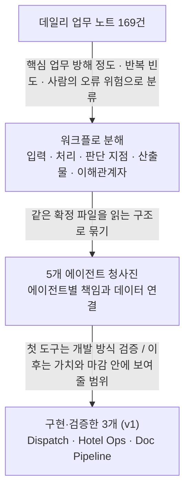
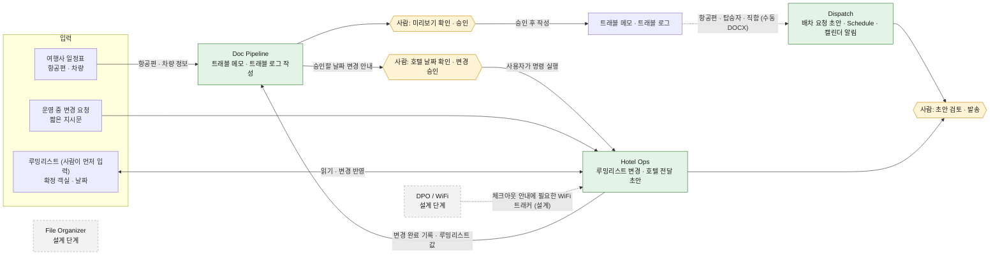
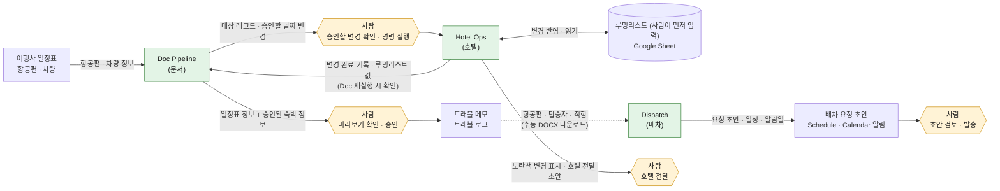
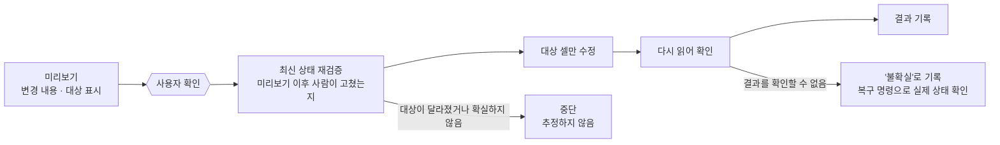

# APPA Travel Automation

> 영화·드라마 제작 현장의 트래블 코디네이터 업무를 데이터 흐름과 판단 단계로 분해하고,
> 사람의 승인을 유지한 채 반복 후속 작업을 자동화한 개인 프로젝트입니다.

[](https://youtu.be/t6W0TLGNT8s)

**▶ 시연 영상** — GPT로 만든 가상 여행자의 왕복 일정표를 입력으로, 세 에이전트가 이어지는 흐름을 보여줍니다.
Hotel Ops(루밍리스트 변경과 노란색 변경 표시) → Doc Pipeline(트래블 메모·트래블 로그 작성) →
Dispatch(배차 요청 초안, Schedule 기록, 캘린더 알림) 순서입니다.

영상에서 구분해 둔 경계는 다음과 같습니다.
- 호텔 확인과 숙박 날짜는 **모의 입력**입니다. 실제 호텔 확인이 아닙니다.
- Google Doc → DOCX → Dispatch 연결은 **수동**입니다.
- 배차 요청 메시지는 **초안만 생성**하며 실제로 발송하지 않습니다.

## 이 README 읽는 법

| 시간 | 볼 곳 | 알 수 있는 것 |
|---|---|---|
| 30초 | 위의 영상과 "프로젝트 한눈에 보기" | 무엇을 만들었고, 제가 무엇을 맡았고, 어디까지 검증했는지 |
| 3분 | "현업에서 발견한 문제", "전체 업무 청사진과 Foundation 결정" | 어떤 문제를 어떻게 구조화했고, 무엇을 먼저 만들기로 했는지 |
| 10분 | "구현된 v1", "검증과 개선" | 에이전트가 어떻게 이어지는지, 실패를 어떻게 발견해 고쳤는지 |
| 더 보기 | "AI 협업", "검증 범위·한계·다음 단계", "타임라인·실행·문서 안내" | 개발 방식, 한계, 실행 방법, 원문 문서 |

## 목차

1. [프로젝트 한눈에 보기](#프로젝트-한눈에-보기)
2. [현업에서 발견한 문제](#현업에서-발견한-문제)
3. [전체 업무 청사진과 Foundation 결정](#전체-업무-청사진과-foundation-결정)
4. [구현된 v1](#구현된-v1)
5. [검증과 개선](#검증과-개선)
6. [AI 협업](#ai-협업)
7. [검증 범위·한계·다음 단계](#검증-범위한계다음-단계)
8. [자주 묻는 질문](#자주-묻는-질문)
9. [타임라인·실행·문서 안내](#타임라인실행문서-안내)
10. [한 줄 정리](#한-줄-정리)

---


## 프로젝트 한눈에 보기

| 항목 | 내용 |
|---|---|
| 만든 것 | Dispatch(배차)·Hotel Ops(호텔)·Doc Pipeline(문서) 에이전트 3개의 v1 프로토타입 |
| 제가 한 일 | 문제 정의, 업무 규칙, 우선순위, 승인 기준, 사용자 테스트(UAT) |
| AI 협업 | 구현 Claude Code · 설계 검토 GPT/Astra · 코드 감사 Codex (제품 안에서 AI를 쓰는 부분은 아래 "AI 협업" 섹션에서 따로 설명합니다) |
| 검증 범위 | 개인정보 없는 가상 데이터(GPT로 생성)로 검증했습니다. 촬영 종료 후 업무 기록을 복기해 만들었고, 제작 현장에서 실제로 사용한 제품은 아닙니다. |

### 구현한 3개 에이전트

| 에이전트 | 하는 일 | 사람이 하는 일 |
|---|---|---|
| Dispatch(배차) | 트래블 메모(Travel Memo)를 읽어 공항 픽업·샌딩 배차 요청 초안을 만들고, 공항 픽업 일정표(Schedule)와 Google Calendar(요청일 오전 9시 일정, 캘린더 알림)에 기록합니다. | 초안 검토와 발송 |
| Hotel Ops(호텔) | 사람이 먼저 입력해 둔 루밍리스트(Rooming List)의 변경을 미리보기 → 사용자 확인 → 재검증 → 대상 셀만 수정 → 다시 읽어 확인의 순서로 반영하고, 변경 셀을 노란색으로 표시해 호텔 전달용 카카오톡·이메일 초안을 만듭니다. | 변경 결정과 확인, 호텔 전달 |
| Doc Pipeline(문서) | 일정표를 입력으로 트래블 메모와 트래블 로그(Travel Log)를 미리보기·승인 후 작성합니다. 숙박 정보는 Hotel Ops에서 사람이 확인한 값을 씁니다. | 미리보기 확인과 승인 |

### 숫자로 보기

| 항목 | 값 |
|---|---|
| 분석한 업무 기록 | 데일리 노트 169건 |
| 청사진 / 구현 | 에이전트 5개를 설계하고 3개를 v1로 구현 |
| 자동 테스트 | 881개 통과 (Hotel Ops 705 · Doc Pipeline 100 · Dispatch 76). 29개는 실제 메모 파일이 없어 건너뜀. 이 저장소에서 실행한 값 |
| 직접 사용자 테스트(UAT) | Hotel Ops 2회(1차 일부 실패 → 2차 통과), Doc Pipeline 7단계 통과 |
| 라이브 검증 | 개인정보 없는 별도 Google 시트에서 쓰고 다시 읽어 확인. Doc Pipeline은 가상 여행자 2명(왕복·편도) |
| 제품 실행 중 LLM 호출 | 없음 (규칙 기반) |


### 이 저장소에 대하여

이 저장소는 비공개 개발 저장소에서 실제 메모, 이름, 시트 링크 등을 제거하고 가상 이름으로 바꿔 내보낸 것입니다.
- 문서 안의 커밋 해시는 비공개 저장소 기준이라 여기서는 확인할 수 없습니다.
- 실제 트래블 메모 파일이 있어야 하는 Dispatch 테스트 29개는 이 저장소에서 건너뜁니다.

<details>
<summary>English summary</summary>

APPA Travel Automation is a personal project that breaks down a film-production travel coordinator's daily work and automates repetitive follow-up tasks while keeping a human approval step. I built three v1 agent prototypes (Dispatch, Hotel Ops, Doc Pipeline) and verified them through live checks and my own user acceptance testing (UAT). AI coding tools handled implementation; I owned problem definition, business rules, priorities, acceptance criteria and UAT. No real messages were sent and no personal data is included.
</details>

---

## 현업에서 발견한 문제

해외 작품의 국내 촬영에서 트래블 코디네이터로 일하며 겪은 문제입니다.
촬영이 끝난 뒤 당시 업무 기록을 분석해 정리했고, 별도의 사용자 인터뷰는 하지 않았습니다.

### 한 명의 항공편이 확정되면

프리프로덕션 초반에는 해외 크루의 항공권 예약이 하루 4~5명씩 이어졌습니다.
한 명의 항공편이 확정되면 그 정보를 여러 문서에 각각 반영해야 했고,
각 문서는 서로 다른 사람이 기다리고 있었습니다.

| 문서 | 기다리는 사람 | 늦어지면 생기는 일 |
|---|---|---|
| 트래블 메모 | 연출팀·프로덕션팀, 크루 | 입국일을 기준으로 미팅·리허설 등 준비 일정을 조율하기 어렵고, 크루는 출발 시각을 모른 채 기다려야 합니다. |
| 루밍리스트 | 호텔 담당자 | 체크인을 당기거나 체크아웃을 미루는 요청이 늦으면 잡아둔 객실을 쓰지 못할 수 있고, 룸 체인지나 숙박 불가로 이어질 수 있습니다. |
| 트래블 로그 | 프로덕션팀·리더십 | 밀린 로그를 한꺼번에 수기로 정리하게 되어 리더십 전달이 늦어지고, 이를 참고하는 데일리 프렙 스케줄 배포에도 영향을 줍니다. |
| 공항 픽업 일정표 | 트랜스포팀 | 정확한 일정을 받아야 공항 픽업·샌딩 차량을 준비할 수 있습니다. |

이 밖에도 TA(Travel Authorization), 무브먼트 리스트(Movement List), 호텔 객실 폴리오,
이심·와이파이 견적서, 회계팀의 DPO(Digital Purchase Order) 요청이 있었습니다.
회계팀은 이 정보를 받아야 예산을 정확히 보고할 수 있고, 승인 절차가 길어서 전달이 늦으면 지출 집행도 함께 늦어집니다.

### 문제의 구조

1. **같은 정보, 서로 다른 형식.** 수신자마다 필요한 정보의 범위가 다릅니다. 무브먼트 리스트에는 항공권·차량 비용이 들어가야 하지만, 전체 프로덕션이 보는 문서에서는 빠져야 했습니다. 문서가 여러 개인 것은 불가피했고, 확정된 변경을 수신자별 형식으로 다시 옮기는 일이 수작업이었습니다.
2. **변경이 몰리면 문서가 밀립니다.** 항공편과 호텔이 동시에 바뀌면 관계자와의 긴급한 소통과 판단이 먼저였고, 문서 업데이트는 뒤로 밀렸습니다. 밀린 문서는 나중에 한꺼번에 작성하게 되어 전달이 더 늦어졌습니다.
3. **사람의 오류 위험이 있습니다.** 변경 하나를 여러 문서와 메시지에 각각 반영하는 과정에서 일부를 빠뜨리거나 중복 전달할 수 있었고, 변경이 집중되면 앞서 받은 조건(예: 객실 타입)을 놓칠 위험도 있었습니다.

반복 문서 작업에 시간을 쓰면 옵션 비교나 관계자 조율처럼 사람이 판단해야 하는 일에 쓸 시간이 줄어듭니다.

### 그래서 자동화할 대상은 "판단 이후의 반복 작업"

호텔 확정, 비용 부담, 승인 같은 판단은 사람이 합니다. 자동화할 대상은 사람이 한 번 내린 결정 뒤에 따라오는
문서 수정, 날짜·숙박일수 계산, 이력 기록, 전달 초안 작성입니다. 이 기준이 이후 모든 설계 결정의 출발점입니다.

루밍리스트는 프리프로덕션 초반에 호텔과 가장 먼저 소통해 객실을 잡아 두면서 만드는 문서입니다.
그래서 객실 홀드 내역은 제가 루밍리스트에 먼저 직접 입력한다고 가정했고,
Hotel Ops는 새로 만드는 것이 아니라 이미 입력된 기록을 고치는 방향으로 설계했습니다.

### 후보를 고른 방법

- 트래블 코디네이터 업무 중 작성한 데일리 노트 169건을 분석했습니다.
- 핵심 업무를 방해하는 정도, 반복 빈도, 사람의 오류 위험을 기준으로 업무를 분류했습니다.
- 각 업무를 입력 정보, 처리 과정, 판단 지점, 산출물, 이해관계자로 나누어 워크플로를 분해했습니다.
- 반복이 특히 많았던 업무는 공항 배차 40건 이상, 루밍리스트 수정 35건 이상이었습니다.

이 결과를 다음 섹션의 전체 업무 청사진으로 옮겼습니다.

---

## 전체 업무 청사진과 Foundation 결정

이 프로젝트에서 가장 먼저 한 일은 코드가 아니라 **업무 전체의 지도를 그리는 일**이었습니다.
어떤 정보가 어디서 들어와 어떤 문서와 사람에게 이어지는지를 먼저 정리하고,
그중 어디까지를 v1로 만들지 정했습니다.

### 업무 기록 169건에서 구현 3개까지



### 전체 업무 청사진



- 초록색: v1로 구현·검증한 에이전트 (각 에이전트의 일부 기능)
- 회색 점선: 설계 단계
- 노란 육각형: 사람의 판단·승인 지점
- 실선: 시스템 처리 / 점선 화살표: 수동 전달 또는 설계 단계의 연결

**청사진에서 내린 판단**

1. **입력은 하나, 문서는 여러 개.** 모든 에이전트가 같은 확정 파일을 읽도록 설계했습니다. 한 곳의 값이 바뀌면 다른 에이전트도 같은 값을 봅니다.
2. **사람의 판단 지점을 그림에 남겼습니다.** 호텔 확정·비용 부담·승인은 자동화 대상이 아니고, 그 결정 뒤의 반복 작업만 자동화합니다.
3. **연결은 계약으로 정의하고, 자동 연결은 뒤로 미뤘습니다.** 에이전트 사이의 입력·출력은 미리 정의했지만, 이를 자동으로 이어 주는 오케스트레이터는 통합 단계로 미뤘습니다. 그래서 현재 일부 연결은 사용자가 명령을 실행하거나 파일을 직접 옮깁니다.
4. **시작점은 사람이 입력한 기록입니다.** 객실 홀드처럼 사람이 호텔과 소통해 정하는 값은 사람이 먼저 루밍리스트에 입력합니다. 새 객실을 만드는 일과 TBD 객실 자동 배정은 v1에서 다루지 않고, Hotel Ops는 기존 기록의 변경만 반영합니다.

**5개 중 3개만 구현한 이유**

- 포트폴리오 제출 기한(9/30) 안에 **검증까지 마칠 수 있는 범위**로 한정했습니다.
- 처음 계획한 구현 순서는 Dispatch → Hotel Ops → DPO/WiFi → Doc Pipeline → File Organizer였습니다. 세 번째로 Doc Pipeline을 앞당긴 것은 포트폴리오 제출 기한 안에 **문서 자동화까지 보여주고 싶었기 때문**입니다. 업무 가치를 다시 계산한 것이 아니라, 기한 안에 무엇을 보여줄 수 있는지를 기준으로 한 선택입니다. 그 결과 Hotel Ops에서 확인한 숙박 값이 트래블 메모로, 트래블 메모가 Dispatch의 입력으로 이어져 세 에이전트가 하나의 흐름을 이룹니다.
- 각 에이전트도 일부 기능만 v1로 구현했습니다. Hotel Ops는 세 기능(루밍리스트 업데이트 PG, 레이트 체크아웃 요청 PI, 체크아웃 안내 메일 PJ) 중 **루밍리스트 업데이트(PG)** 만, Doc Pipeline은 트래블 메모 작성(PA)과 트래블 로그입니다. (PI·PJ는 구현하지 않았습니다.)
- Telegram·웹 인터페이스, 실제 발송, TBD 객실 자동 배정은 핵심 로직 이후로 미뤘습니다.
- DPO/WiFi와 File Organizer는 설계 단계로 남겼습니다.

### Foundation: 문서를 만든 것이 아니라 결정을 한 것

| 기획 질문 | 제가 내린 결정 | 산출물 |
|---|---|---|
| 이 업무의 시작과 끝은 어디인가? | 업무를 입력·판단·후속 작업·결과물로 나누고, 기능마다 트리거·입력 데이터 위치·산출물·담당자 4가지 계약으로 정리 | [Workflow Breakdown](01.%20Foundations/%23%20APPA%20Production%20Coordination%20-%20Agent%20A.md) |
| 어떤 기능끼리 묶어야 하는가? | 에이전트별 책임 경계와 연결 관계 정의. 오케스트레이터는 통합 단계로 연기 | [Agent Blueprint](01.%20Foundations/APPA_Agent_Blueprint.md) |
| 어떤 값이 어디의 기준인가? | 원천 → 확정 예약 → 에이전트 → 산출물의 4개 층으로 나누고, 모든 에이전트가 같은 확정 파일을 읽도록 함 | [Data Schema](01.%20Foundations/APPA_Data_Schema_Diagram.md) |
| 무엇을 먼저 구현할 것인가? | 첫 도구는 개발 방식 검증, 이후는 가치와 마감을 함께 고려해 구현 순서 결정 | [Agent Build Flow](01.%20Foundations/RECAP_Agent_Build_Flow.md) |
| 언제 진행하고 언제 멈춰야 하는가? | 승인·완료·실패·재실행 조건을 PRD와 수용 기준으로 명시 | [Dispatch PRD](02.%20Dispatch/PRD_Dispatch.md) · [Hotel Ops PRD](05.%20Hotel%20Ops/PRD_HotelOps_PG_RoomingList.md) · [Doc Pipeline PRD](04.%20Doc%20Pipeline/PRD_DocPipeline_PA.md) |

### 대표 결정 4가지

**1. 호텔 판단은 사람이 한다**
- 결정: 객실 가능 여부, 제작사·개인 부담, 승인 같은 판단은 자동화하지 않습니다. 사람이 한 번 내린 결정 뒤의 루밍리스트 수정, 숙박일수 계산, 이력 기록, 전달 초안 작성만 자동화합니다.
- 트래블 메모에는 확인되지 않은 숙박 정보를 넣지 않습니다. 체크인·체크아웃은 항공 일정이 아니라 **사람이 확인한 루밍리스트 기록**에서 가져오고, 호텔 확인 단계와 제가 호텔에서 확정된 날짜를 입력하는 단계를 항상 거칩니다. (근거: Doc Pipeline PRD §0, §2, §7)
- 이유: 실제 업무에서 같은 날짜 변경도 객실 상황, 비용 부담 주체, 본인 요청에 따라 최종 판단이 달랐습니다.
- 코드에 반영된 모습: 모든 변경은 미리보기 → 사용자 확인 이후에만 쓰고, 메시지는 초안만 만듭니다.

**2. Hotel Ops보다 Dispatch를 먼저 만든다**
- 처음 계획: 루밍리스트 수정이 35건 이상으로 잦아 절감 효과가 클 것으로 보고 Hotel Ops를 첫 도구로 잡았습니다. 루밍리스트는 호텔과 가장 먼저 소통해 객실을 잡아 두며 만드는 문서라서 가장 먼저 존재하고, 객실 홀드 내역은 제가 먼저 직접 입력한다고 가정했습니다. Hotel Ops는 그 기록을 고치는 쪽이라, 다른 에이전트의 결과물을 기다리지 않고 이미 있는 루밍리스트만으로 만들 수 있다고 보았습니다.
- 재검토: 정리해 보니 이 조건은 Hotel Ops만의 것이 아니었습니다. 과거 트래블 메모, 루밍리스트 같은 확정 파일이 모두 이미 있어서 어느 에이전트든 다른 에이전트를 기다리지 않고 만들 수 있었습니다. 그러면 첫 도구는 절감 효과보다 **개발 절차를 끝까지 검증하기 좋은지**가 더 중요하다고 판단했고, 입력이 트래블 메모 하나로 단순한 Dispatch를 골랐습니다.
- 근거: 8/12에 개정한 Agent Blueprint에 "모든 기능이 이미 있는 확정 파일을 읽으므로 에이전트는 어떤 순서로도 만들 수 있다"고 적었습니다.
- 결과: Dispatch에서 요구사항 → 실제 파일 검증 → 외부 시스템 연동 → 회귀 테스트로 이어지는 개발 절차를 먼저 확인한 뒤 Hotel Ops로 넓혔습니다.

**3. v1은 날짜 한 필드 변경까지**
- 결정: Doc Pipeline v1은 한 여행자의 체크인 또는 체크아웃 중 하나가 바뀌는 경우까지 다룹니다. 두 날짜가 함께 바뀌는 경우는 멈추고 후속 버전으로 넘겼습니다.
- 이유: 검증할 수 있는 범위를 먼저 완성하기 위해서입니다.
- 근거: Doc Pipeline PRD의 `[M]` 결정 (`[M]`은 제가 직접 결정한 항목의 표시입니다)

**4. 첫 사용자 테스트 실패 후, 완료 기준을 다시 정한다**
- 기능별 점검은 통과했지만 첫 사용자 테스트에서 호텔에 보낼 통합 초안이 만들어지지 않았고 수동 변경도 빠졌습니다. 완료 기준을 "변경 한 건의 처리"에서 "호텔에 한 번 전달하는 일"로 다시 정해 PRD §31에 반영했고(`[M]`), 두 번째 테스트에서 통과했습니다. 자세한 과정은 "검증과 개선"을 참고해 주세요.
- 수동으로 날짜를 고친 뒤 숙박일수를 보정하는 일은 사람이 하도록 남긴 v1 한계입니다.

---

## 구현된 v1

세 에이전트는 각자 동작하지만, 하나의 일정표에서 출발하는 흐름으로 이어집니다.
연결 지점마다 어떤 정보가 넘어가는지, 그 연결이 자동인지 사람의 승인인지 수동 전달인지를 구분해 표시했습니다.
사용자는 터미널(CLI)에서 명령을 실행합니다. 인터페이스가 핵심 로직 개발을 늦추지 않도록 Telegram·웹은 뒤로 미뤘습니다.

### 에이전트 연결과 데이터 흐름



- 실선: 시스템 처리 / 점선: 수동 파일 전달 / 노란 육각형: 사람의 승인·판단

| 연결 | 넘겨지는 정보 | 연결 방식 | 확인 수준 |
|---|---|---|---|
| 일정표 → Doc Pipeline | 항공편·차량 정보 | 파일 입력 | 라이브 검증 + 직접 UAT (9/29) |
| Doc Pipeline → Hotel Ops | 대상 레코드, 승인할 날짜 변경 | 명령 안내 후 사용자가 실행 | 라이브 검증 + 직접 UAT (9/29) |
| Hotel Ops → Doc Pipeline | 변경 완료 기록, 루밍리스트 값 | Doc Pipeline 재실행 시 확인 | 라이브 검증 + 직접 UAT (9/29) |
| Doc Pipeline → 메모·로그 | 일정표 정보, 승인된 숙박 정보 | 미리보기 → 승인 후 작성 | 라이브 검증 + 직접 UAT (9/29) |
| 트래블 메모 → Dispatch | 항공편·탑승자·직함 | 수동 DOCX 다운로드 후 입력 | Dispatch 전체 데모 (9/29, 제품 UAT 아님) |
| Dispatch → 후속 업무 | 요청 초안·Schedule·리마인더 | Sheet·Calendar에 기록 | 데모 후 독립 read-back (9/29) |

### 자동, 승인, 수동 구분

| 자동 처리 | 사람의 승인 | 수동 |
|---|---|---|
| 일정표 읽기, 배차 요청 문구 생성, CLI 실행 시 Schedule·Calendar 기록, 숙박일수 계산, 요청 이력 기록, 호텔 전달용 초안 생성, 노란색 변경 표시(별도 명령) | 루밍리스트 변경(미리보기 확인 후에만 쓰기), 트래블 메모·로그 작성(미리보기 승인), 호텔 확정·비용 부담, 메시지 발송 | Doc Pipeline → Hotel Ops 명령 실행, Google Doc → DOCX → Dispatch 입력, 수동 날짜 수정 후 숙박일수 보정, 실제 발송 |

**트래블 로그는 무브먼트 리스트 없이 작성합니다.** 일정표에서 항공편을, 사람이 확인한 루밍리스트 기록에서 이름·직함을 가져옵니다. 사람이 미리 만들어 둔 월별 행과 구분선에만 출발 시각 순서로 채우고, 자동으로 쓴 행에는 개발용 표시를 붙여 구분합니다. 무브먼트 리스트는 v1.1 범위입니다.

Dispatch의 캘린더 일정은 요청일(발송일) 오전 9시에 15분 길이로 만들어집니다. 알림 자체는 캘린더의 기본 알림 설정을 따르므로, 캘린더 기본 알림을 "일정 시작 시각"으로 설정해 두어야 9시에 울립니다(설정 방법은 Dispatch의 Google Calendar 설정 문서에 있습니다).

### 쓰기 안전 흐름

시트를 바꾸는 모든 작업은 아래 순서를 따르도록 제품 요구사항으로 정의했습니다.



Hotel Ops에서 통제하려고 한 위험은 다음 다섯 가지입니다.
1. 행 번호나 이름이 바뀌어도 같은 레코드를 찾아야 합니다.
2. 미리보기 이후 사람이 고친 값을 덮어쓰면 안 됩니다.
3. 재실행해도 같은 변경과 같은 요청 이력이 중복되면 안 됩니다.
4. 일부만 성공했거나 결과를 알 수 없을 때 전체 성공으로 표시하면 안 됩니다.
5. 사람이 고친 변경과 에이전트가 고친 변경을 구분해 호텔 전달 전에 검토할 수 있어야 합니다.

대상 시트도 분리했습니다. Hotel Ops는 전용 시트 ID만 사용하고, Dispatch의 시트와 같으면 실행을 멈춥니다.

---

## 검증과 개선

### 무엇을 어떤 방식으로 확인했는가

같은 "검증"이라도 확인하는 것이 다릅니다. 아래 다섯 가지를 구분해 적었습니다.

| 방식 | 확인한 것 | 시점·기준 | 이 검증이 뜻하지 않는 것 |
|---|---|---|---|
| 자동 회귀 테스트 | 코드가 정해진 규칙대로 동작하는지 | 2026-09-30, 이 저장소에서 requirements와 pytest만 설치해 실행: Hotel Ops 705개 통과 · Doc Pipeline 100개 통과 · Dispatch 76개 통과(29개는 실제 메모 파일이 없어 건너뜀). 비공개 개발 저장소에서는 Dispatch 105개가 모두 통과합니다. | 사용자 시나리오 수가 아닙니다. |
| 라이브 검증 | 실제 Google Sheet·문서에 쓰고 다시 읽어 결과 확인 | Hotel Ops 9/22–9/27(개인정보 없는 별도 시트), Doc Pipeline 9/29(가상 여행자 2명, 왕복·편도). 재실행 시 쓰기 0회 | 실제 제작 문서에 쓴 것이 아닙니다. |
| 직접 사용자 테스트(UAT) | 실제 업무 순서대로 써 보고 통과·실패 판정 | Hotel Ops 9/27(1차 일부 실패 → 2차 전 단계 통과), Doc Pipeline 9/29(U1–U7 통과). 제가 직접 조작하고 판정 | 다른 사용자가 쓴 것이 아닙니다. |
| 독립 감사 | 구현과 분리된 AI(Codex)가 커밋 단위로 결함 탐색 | Hotel Ops v1(9/27), Doc Pipeline(9/29) 최종 감사 통과 (비공개 저장소의 커밋 기준) | 제3자 인증이 아닙니다. |
| 시연 | 흐름 전체를 보여줌 | Dispatch 전체 데모(9/29), 시연 영상 | 검증을 대체하지 않습니다. |

감사와 태그 기록은 커밋 해시로 남아 있고, 그 이력은 비공개 개발 저장소에 있습니다.

### 대표 사례 1 — 첫 사용자 테스트 실패에서 완료 기준을 다시 정하다

**설계.** 기능별 체크리스트 대신 실제 업무 순서로 테스트를 짰습니다. 객실을 잡고(초기 17행) → 1차 변경(4행) → 호텔에 보낼 통합 초안 → 전달했다고 가정하고 초기화 → 2차 변경(2행) → 초안 → 초기화. 제가 호텔 담당자에게 변경을 모아 전달하던 실제 순서입니다.

**1차 결과(9/27).** 날짜 변경, 변경 이력, 초안 생성은 각각 동작했지만 다음이 실패했습니다.
- 초안이 변경 한 건씩만 만들어져서 호텔에 보낼 통합 초안이 없었습니다.
- 시트에서 직접 고친 항목이 초안에 빠졌습니다.
- 날짜를 손으로 고치면 숙박일수가 갱신되지 않았습니다.

**제가 바꾼 것.** 완료 기준을 "변경 한 건의 처리"에서 "호텔에 한 번 전달하는 일"로 바꾸고 PRD §31에 `[M]`으로 반영했습니다.
- 한 변경 구간의 수동·에이전트 변경을 노란색 표시와 같은 기준 시점으로 비교해, 카카오톡 초안 1개와 이메일 초안 1개로 만듭니다.
- 검토를 마친 뒤 초기화해야 다음 구간으로 넘어갑니다.
- 추가·삭제된 행처럼 자동으로 판단하기 어려운 변경은 호텔 초안에 넣지 않고 내부 검토 목록에 따로 보여줍니다. 사람이 기록마다 "직접 전달·처리함" 또는 "호텔에 알릴 필요 없음(사유 입력)" 중 하나를 결정해야 변경 구간을 닫을 수 있습니다. 이 결정은 제 진술로만 저장하고, 실제 발송이나 호텔의 확인을 시스템이 확인했다고 기록하지 않습니다.
- 호텔 초안에는 숙박일수를 넣지 않습니다.

구현 뒤 독립 감사(Codex)에서 결함이 두 차례 지적되어 고쳤고 통과했습니다.

**2차 결과(9/27, 새 가상 데이터 시트·별도 상태 저장소).** 초기 설정과 세 번의 변경·검토 구간(변경 셀 15개, 6개, 추가·삭제 기록 확인)이 모두 통과했습니다. 종료 상태는 루밍리스트 17개 기록, 노란색 변경 0, 실행된 작업 5건, 불확실 0건이며 실제 카카오톡·이메일 발송은 없었습니다.

**남은 한계.** 수동 날짜 수정 뒤 숙박일수는 사람이 고치고 요청 이력에 기록하는 절차로 남겼습니다.

### 대표 사례 2 — 실제 시트 구조가 가정과 달랐던 것을 쓰기 전에 발견하다

- **발견한 위험.** 실제 루밍리스트와 같은 구조의 개인정보 없는 시트를 읽기 전용으로 점검하니, 머리글이 1행이 아니라 4행에 있었습니다(위에 빈 줄과 제목). 코드는 1행을 머리글로 가정하고 있었고, 자동 테스트 333개는 모두 같은 가정으로 작성되어 통과하고 있었습니다.
- **제가 정한 규칙.** 시트를 수정하기 전에 읽기 전용 점검을 먼저 하고, 명시적 승인 전에는 ID 부여·업무 쓰기·노란색 표시를 하지 않습니다. 시트의 모양을 테스트에 맞게 바꾸지 않고, 코드가 실제 구조를 흡수하도록 어댑터를 만듭니다.
- **확인한 결과.** 수정 후 다시 점검해 머리글 위치, ID 중복 없음, 결제 구분 값을 확인했고, 그날 시트 수정은 0회였습니다. 구현은 Claude Code, 감사는 Codex가 맡았고 차단 결함 없이 통과했습니다.
- **배운 점.** "머리글 이름으로 읽는다"와 "시트 구조에 독립적이다"는 다릅니다. 외부 시트를 기준으로 삼을 때는 값의 규칙뿐 아니라 머리글 행, 앞쪽 열, 빈 줄, 수식, 서식 같은 모양도 먼저 확인해야 합니다.

---

## AI 협업

이 저장소에서 "에이전트"는 정해진 업무 규칙에 따라 여러 단계를 실행하고, 중요한 지점마다 사람의 확인을 받는 자동화 프로그램을 뜻합니다.
AI는 두 곳에서 다르게 쓰였습니다. **개발 과정**에서는 적극적으로 썼고, **제품이 실행되는 동안(v1)** 에는 쓰지 않았습니다.

### 개발 과정: 역할을 나누어 서로 확인하게 했습니다

| 역할 | 맡은 일 |
|---|---|
| 저 (Myungha) | 문제 정의, 업무 규칙, 우선순위, 범위, 승인 기준, 사용자 테스트(UAT), 릴리스 판단 |
| Claude Code | 구현 (저장소에 코드를 쓰는 유일한 주체) |
| GPT / Astra | 설계 검토, 아키텍처 점검, 의사결정 지원 |
| Codex | 정확한 커밋 단위의 독립 코드 감사 |

- 구현하는 주체와 감사하는 주체를 분리했습니다. 감사는 특정 커밋을 기준으로 하고, 결함(BLOCKER)만 고치며 나머지는 다음 버전 목록으로 넘깁니다.
- 같은 결함이 세 번째로 다시 지적되면 코드를 더 고치지 않고, 설계 문제인지 먼저 판단합니다.
- 세션 로그에 판단의 주체를 `[ME]`(제가 판단), `[AI→ME]`(AI가 제안하고 제가 검토·선택), `[AI]`(AI가 구현·검증)로 구분해 기록했습니다.

### v1: 제품은 규칙 기반으로 동작합니다

- 세 에이전트(Dispatch, Hotel Ops, Doc Pipeline) 모두 실행 중에 LLM이나 외부 AI API를 호출하지 않습니다. 외부 호출은 Google Sheets·Docs·Calendar API뿐이고, 일정표 PDF는 pdfplumber로 읽습니다.
- Hotel Ops Path B는 정해 둔 좁은 문법의 짧은 문장(예: `<이름> checkout 6/19 → 6/21`)만 받습니다. 지원하는 항목은 체크인, 체크아웃, 객실, 결제 구분, 비고, 레이트 체크아웃입니다. 문법을 벗어나면 추정하지 않고 멈춘 뒤 다시 묻습니다.
- 규칙 기반으로 한 이유: 공유 시트를 수정하는 작업은 같은 입력에 같은 결과가 나오고, 실패를 재현해 테스트로 고정할 수 있어야 한다고 판단했습니다. 초기 프로토타입인 Received Options에서 정규식은 형식이 조금만 달라져도 실패했고, LLM은 처리가 느렸으며, 둘을 합치자 읽고도 잘못된 값을 내는 경우가 있었습니다.
- Received Options 프로토타입은 이 저장소에 포함되어 있지 않습니다.

### v1.1 계획: 자연어 지시와 챗봇 인터페이스 (제출 후 계획이며 구현된 것이 아닙니다)

- Telegram 같은 챗봇 인터페이스를 붙이고, LLM으로 복잡한 자연어 지시문을 해석해 에이전트를 실행하는 기능을 만들 계획입니다. **Hotel Ops Path B의 고도화부터** 시작합니다.
- 설계 원칙은 9/10에 정했습니다. 인터페이스는 어댑터일 뿐이고, 대상 찾기·검증·쓰기 규칙은 공통 코어가 맡습니다.
- 그래서 LLM이 하는 일은 자연어를 구조화된 변경으로 바꾸는 부분까지로 한정하려 합니다. 이후의 미리보기 → 사용자 확인 → 재검증 → 대상 셀만 수정 → 다시 읽어 확인 흐름은 지금과 같은 경로를 통과합니다. 해석이 확실하지 않으면 지금처럼 추정하지 않고 되묻습니다.
- 평가 방법: 고정된 지시문 세트를 만들어 해석 정확도와 되묻기 비율을 측정할 계획입니다. Received Options에서 테스트 세트 없이 고치다가 어려웠던 경험을 반영한 것입니다.

## 검증 범위·한계·다음 단계

### 검증하지 않은 것
- 호텔 확인과 숙박 날짜는 모의 입력입니다. 실제 호텔 담당자의 확인은 없었습니다.
- 시연과 검증에 쓴 여행자와 일정은 GPT로 만든 가상 데이터입니다.
- 카카오톡·이메일은 초안만 만들고 실제로 발송하지 않았습니다.
- 일부 연결은 수동입니다. (Google Doc → DOCX → Dispatch, Doc Pipeline → Hotel Ops 명령 실행)
- 차량 회사 전화번호는 검증하지 않았습니다. (v1 트래블 메모 범위 밖)
- 제작 현장에서 반복 사용하거나 처리 시간·오류율을 측정하지 않았습니다.
- Doc Pipeline의 마지막 변경(트래블 메모 복구 경로)은 회귀 테스트와 감사로 확인했고 라이브로 다시 실행하지 않았습니다.

### 알려진 한계
- 수동으로 날짜를 고친 뒤 숙박일수는 자동으로 다시 계산되지 않습니다. 사람이 고치고 요청 이력에 기록하는 절차로 남겼습니다.
- 한 여행자의 체크인·체크아웃이 동시에 바뀌면 Doc Pipeline이 멈춥니다.
- 직접 UAT에서 본 화면 문제: 트래블 메모 미리보기의 줄바꿈이 `\x0b`로 보이고, 트래블 로그 미리보기의 날짜·시각이 일련번호로 보이며, 날짜를 묻지 않는 단계가 있었습니다.
- 인터페이스는 CLI뿐이고, Hotel Ops의 짧은 지시문은 정해 둔 좁은 문법만 받습니다.
- 공개 저장소에서는 실제 트래블 메모 파일이 필요한 테스트 29개를 건너뜁니다.

### 다음 단계 (계획이며 구현된 것이 아닙니다)
1. Hotel Ops Path B 고도화, Telegram·챗봇 인터페이스, LLM 기반 자연어 지시 해석 (위 "v1.1 계획")
2. 가상 트래블 메모 DOCX 테스트 데이터를 만들어, 건너뛰는 29개 테스트를 누구나 실행할 수 있게 하기
3. 레이트 체크아웃 요청(PI), 체크아웃 안내 메일(PJ), 무브먼트 리스트, 경유편·추가 구간, 이후 일정 변경, 실제 발송(승인 절차 포함)
4. 측정 계획(실적이 아닙니다): 작업 완료율, 수정률, 예외·불확실 비율, 초안 작성 시간과 수작업 대비. 사용 전 수작업 처리 시간과 오류를 기록해 baseline으로 삼습니다.

---

## 자주 묻는 질문

### 제작 현장에서 실제로 쓰였나요?

아닙니다. 촬영이 끝난 뒤 업무 기록을 복기해 만든 프로토타입이고, 가상 데이터로 검증했습니다. 카카오톡·이메일은 초안만 만들고 발송하지 않았습니다.

### AI(LLM)는 어디에 쓰였나요?

개발 과정에서 썼습니다. 구현은 Claude Code가 했고, 저는 문제 정의와 업무 규칙, 승인 기준, 사용자 테스트를 맡았습니다. 제품 v1은 실행 중에 LLM을 호출하지 않는 규칙 기반이고, LLM과 챗봇 인터페이스는 v1.1 계획입니다. ([AI 협업](#ai-협업) 참고)

### 왜 Hotel Ops가 아니라 Dispatch를 먼저 만들었나요?

모든 에이전트가 이미 있는 확정 파일을 읽기 때문에 어떤 순서로도 만들 수 있었습니다. 그러면 첫 도구는 절감 효과보다 개발 절차를 끝까지 검증하기 좋은 것이 낫다고 판단했고, 입력이 트래블 메모 하나로 단순한 Dispatch를 골랐습니다.

### 왜 5개 중 3개만 구현했나요?

포트폴리오 제출 기한 안에 검증까지 마칠 수 있는 범위로 한정했습니다. Doc Pipeline은 문서 자동화까지 보여주기 위해 원래 순서보다 앞당겨 만들었습니다.

### 직접 실행해 볼 수 있나요?

테스트는 실행할 수 있습니다. ([실행과 테스트](#실행과-테스트) 참고) 다만 실제 Google 시트·캘린더에 쓰는 실행에는 서비스 계정과 별도의 시트가 필요하고, 실제 트래블 메모 파일이 필요한 Dispatch 테스트 29개는 이 저장소에서 건너뜁니다.

---


## 타임라인·실행·문서 안내

### 타임라인

| 시기 | 내용 |
|---|---|
| 8/11 | 업무 기록 분석, 5개 에이전트 청사진·데이터 스키마·업무 계약 정리 |
| 8/12–8/14 | Dispatch 구현: 로컬 처리 → 실제 트래블 메모로 보강 → Google Calendar 알림 연동 |
| 9/10–9/16 | Dispatch의 Google Sheets 연동 마무리, Hotel Ops 범위 정의와 설계 검토(PRD) |
| 9/20–9/27 | Hotel Ops 라이브 검증, 사용자 테스트 2회, v1 완료 |
| 9/28–9/30 | Doc Pipeline 감사·라이브 검증·직접 UAT, Dispatch 전체 데모, 시연 영상 |

### 실행과 테스트

Python 3 환경에서 에이전트마다 가상환경을 만들어 `requirements.txt`와 pytest를 설치한 뒤 테스트를 실행합니다.

```bash
(cd "05. Hotel Ops" && pip install -r requirements.txt pytest && python -m pytest -q)
(cd "04. Doc Pipeline" && pip install -r requirements.txt pytest && python -m pytest -q)
(cd "02. Dispatch" && pip install -r requirements.txt pytest && python -m pytest -q)
```

실제 Google Sheets·Docs·Calendar에 쓰는 실행에는 서비스 계정 키와 개인정보가 없는 별도의 시트가 필요합니다.
환경 변수(예: `APPA_HOTEL_GSHEET_ID`, `APPA_HOTEL_GSHEET_TAB`, `APPA_HOTEL_STATE_PATH`, `APPA_GOOGLE_SA_KEY`)로 지정하며, 값과 키는 저장소에 넣지 않습니다.
설정 절차는 [Google Calendar 설정](02.%20Dispatch/SETUP_GoogleCalendar.md), [Google Sheets 설정](02.%20Dispatch/SETUP_GoogleSheets.md), [Hotel Ops 실행 런북](05.%20Hotel%20Ops/RUNBOOK_LIVE1_RoomingList.md)을 참고해 주세요.

### 폴더 구조

| 폴더 | 내용 |
|---|---|
| `01. Foundations` | 청사진, 데이터 스키마, 업무 계약, 개발 절차 문서 |
| `02. Dispatch` | Dispatch 에이전트, PRD, 설계·리뷰·설정 문서 |
| `04. Doc Pipeline` | Doc Pipeline 에이전트와 PRD |
| `05. Hotel Ops` | Hotel Ops 에이전트, PRD, 실행 런북 |
| `CLAUDE.md`, `AGENTS.md` | 구현을 맡은 AI(Claude Code)에게 주는 규칙: 안전 규칙, 범위, 역할 분담 |

### 문서

| 종류 | 문서 |
|---|---|
| 전체 설계 | [Agent Blueprint](01.%20Foundations/APPA_Agent_Blueprint.md) · [Data Schema](01.%20Foundations/APPA_Data_Schema_Diagram.md) · [Workflow Breakdown](01.%20Foundations/%23%20APPA%20Production%20Coordination%20-%20Agent%20A.md) · [Agent Build Flow](01.%20Foundations/RECAP_Agent_Build_Flow.md) · [PRD 템플릿](01.%20Foundations/AGENT_BUILD_PRD_TEMPLATE.md) |
| PRD(계약) | [Dispatch](02.%20Dispatch/PRD_Dispatch.md) · [Hotel Ops](05.%20Hotel%20Ops/PRD_HotelOps_PG_RoomingList.md) · [Doc Pipeline](04.%20Doc%20Pipeline/PRD_DocPipeline_PA.md) |
| 테스트·검토 | [Dispatch 테스트 전략](02.%20Dispatch/TEST_STRATEGY_Dispatch_KO.md) · [Hotel Ops 런북](05.%20Hotel%20Ops/RUNBOOK_LIVE1_RoomingList.md) |

---

## 한 줄 정리

반복 후속 작업은 자동화하고, 호텔 확정·비용·승인 같은 판단은 사람에게 남겼습니다.

- **문제:** 같은 일정 정보를 여러 문서와 메시지에 옮기는 반복 작업
- **설계:** 쓰기 전에 미리보기와 사용자 확인을 거치고, 쓴 뒤에는 다시 읽어 확인합니다
- **검증:** 사용자 테스트에서 실패한 부분은 완료 기준을 고쳐 다시 확인했고, 확인하지 못한 것은 한계로 적었습니다
